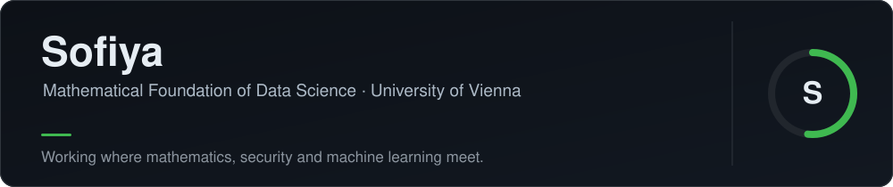
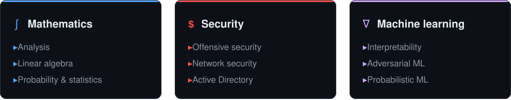

### About

Second-year **Mathematical Foundation of Data Science** student at the University of Vienna. I'm drawn to the places where mathematics, security and machine learning overlap — understanding why models work, how systems fail, and how to prove either one.

### Focus

### Selected work

| Project | What it is |
| :-- | :-- |
| [**mfds_univie_first_year**](https://kulchankas.github.io/mfds_univie_first_year/) | A self-built study hub for first-year university mathematics: study plans, flashcard decks and progress tracking. |
| [**paranoid**](https://github.com/kulchankas/paranoid) | A security agent skill for Claude Code, Codex and Cursor. Its `/hack-me` command pentests your own running app on localhost — finding, proving, patching and re-verifying real vulnerabilities. |

### Toolbox

Languages: English · Russian · Belarusian · Polish &nbsp;·&nbsp; <a href="mailto:kulchankas@gmail.com">kulchankas@gmail.com</a>
