## 🕵️ paranoid

<a href="https://github.com/kulchankas/paranoid"></a>


**Your app is guilty until proven secure.** `paranoid` is an agent skill for Claude Code, Codex and Cursor. Its core, **`/hack-me`**, breaks into your *own* running app on localhost the way an attacker would: it finds a hole, proves it with a real request, patches the root cause, and re-verifies the exploit now fails.

<a href="https://github.com/kulchankas/paranoid"></a>

Pointed at a small invoicing API it was told nothing about, `/hack-me` found four real bugs by probing, proved each with a live request, fixed them, and confirmed legitimate traffic still works:

| # | Found by probing the API | Class | After patch |
|---|---|---|:--:|
| 1 | Any user reads any invoice | IDOR / broken object auth | `404` |
| 2 | `/admin/users` open to anyone logged in | broken function auth | `403` |
| 3 | `/search?email=` dumps password hashes | SQL injection | `[]` |
| 4 | `/profile` accepts `is_admin` | mass assignment → priv-esc | `400` |

I built it benchmark-first: a reproducible harness showed that *advising* a capable model to "write secure code" adds nothing on isolated functions, because real bugs live in the wiring of a whole running app. So paranoid stops advising and starts attacking. Authorized, defensive, localhost-only.

```bash
npx skills add kulchankas/paranoid/skills/paranoid
```

<br>

## Interests


<sub>English · Russian · Belarusian · Polish &nbsp;·&nbsp; <a href="mailto:kulchankas@gmail.com">kulchankas@gmail.com</a></sub>
