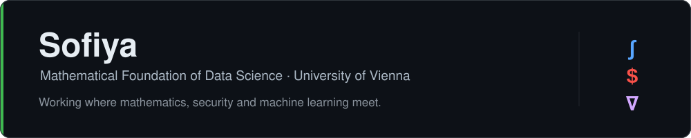

### Hi, I'm Sofiya 👋

Second-year **Mathematical Foundation of Data Science** student at the University of Vienna — working where rigorous mathematics meets security and machine learning.

#### About me

- 🎓 Building my foundation at Uni Wien — analysis, linear algebra, probability & statistics
- 🔐 Practising offensive security in my own lab — networks, Active Directory, and web
- 🧠 Following the ML research I care about — interpretability, adversarial ML, probabilistic models
- 🛠️ Author of [**paranoid**](https://github.com/kulchankas/paranoid) — a security agent skill that pentests your own running app, then proves and patches what it finds
- 💬 Reach me at **kulchankas@gmail.com**

#### Toolbox

Languages: English · Russian · Belarusian · Polish
